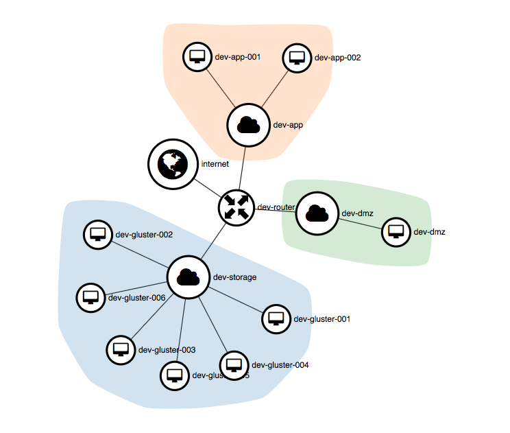

## GlusterFS Deployment Example


This demo creates a 3-tiered infrastructure with the following components:

- Bastion Server
- Web Server
- GlusterFS Storage Cluster

This infrastructure would be a suitable starting point for serving static media or
compute-intensive workloads.

## Bastion Server

A bare-bones CentOS machine which can be used to connect to the other nodes in the infrastructure via SSH tunneling.  This is also how Ansible connects to the infrastructure.

## Web Server

A cluster of servers that mount the shared Gluster filesystem on /var/www/html/.

This cluster is scaleable via the `compute_count` variable in `terraform/vars.tf`.  By default, 2 servers are deployed.

## GlusterFS

This cluster of machines uses OpenStack volumes to create a shared filesystem.  There are 2 replicas for data.  

This cluster can be scaled by changing the `gluster_count` variable in `terraform/vars.tf`.  Due to the way replication works, this needs to be done in increments of 2.

## Deployment

1. Create an OpenStack keypair named `gluster-demo`.

```bash
openstack keypair create gluster-demo > gluster-demo.key
chmod 600 gluster-demo.key
```

2. Initialize Terraform

```bash
cd terraform/
terraform init
cd ..
```

2. Use Ansible to run the playbook `main.yaml`

```bash

ansible-playbook -i openstack.yaml main.yaml

```

## Teardown

Use terraform to remove the demo.

```bash

cd terraform/
terraform destroy
```
